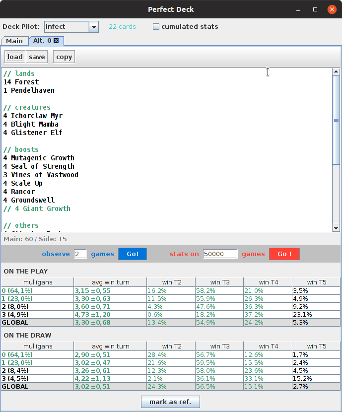
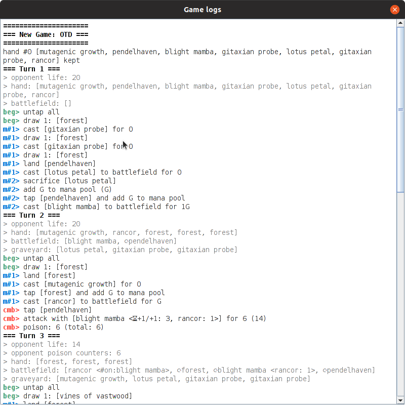

# Perfect Deck

This project provides a set of tools for optimizing a [Magic: The Gathering](https://magic.wizards.com) deck.



## About goldfishing

[Goldfishing](https://mtg.gamepedia.com/Goldfishing) is one of the possible approaches to optimize a deck.

Not the only one, not the best one, just one of the ways. 
Quite relevant though with **aggro** or **combo** decks, where **speed** is a key factor.

Perfect Deck is a tool (developed in Java) that helps you simulate hundreds of games in just milliseconds, accelerating
the optimization process by more that a factor of magnitude.

Perfect Deck is intended for developers and non-developers, but with a different scope of use. Here is a table which 
represents the 3 factors allowing to optimize a deck.

| optimization factor | explanation             | in Perfect Deck           | scope           |
| ------------------- | ----------------------- | ------------------------- | --------------- |
| game strategy       | How do you play your cards? When do you land, which land first? How do you optimize your curve? Sometimes it's obvious, sometimes it's not (ex: how would you play Magma Jet in a burn deck? Some argue it's optimal on T3 upkeep to filter out lands for the next two turns) | This has to be developed (this is called the _deck pilot_) | For developers |
| mulligans strategy  | What are the objective criteria to **keep** or **reject** a hand ?<br/>Too restrictive criteria will cause a large rate of mulligans, while too loose criteria will probably leave you with slow hands. | This has to be developed (in the _deck pilot_ too) | For developers |
| the list            | This is a very obvious optimization factor. Changing the cards, the number of mana sources, ... has a direct impact of your deck speed. | Deck editor in the tool | For everyone |

## How to run it?

The tool is packaged in an auto executable jar, so all you need is:

* Java installed (v>=8),
* download the tool (jar) from the releases page,
* double click the jar file.


## Using Perfect Deck

Once started, select the _deck pilot_ you want to use, and type-in a deck list in the editor.

### Observe games

From that point you can **observe** some games (that is run some games and see the logs) in order to make sure the pilot
is making wise decisions (if not the case, you'll have either change the _deck pilot_ code and propose me a 
[pull request](https://github.com/pismy/perfect-deck/pulls), or create an [issue](https://github.com/pismy/perfect-deck/issues) 
with all required details).



### Compute statistics

You can also (and btw it's the very goal of Perfect Deck) simulate a large number of games and **compute statistics**.

At any time you can **mark the current statistics as a reference** (thus all other statistics will be compared to this one),
and you can also **copy** the current deck list (create a cloned tab) to work on an alternate version of the list.


## Deck editor

This tool supports MWS, Apprentice and [Cockatrice](https://github.com/Cockatrice/Cockatrice/wiki/Deck-List-Import-Formats) deck file formats.

Here is an example of a deck file:

```
// discard
4 Faithless Looting
4 Putrid Imp

// reanimation
4 Animate Dead
4 Exhume

// steaks
4 Hand of Emrakul
2 Greater Sandwurm
1 Pathrazer of Ulamog
4 Ulamog's Crusher

// mana
3 Dark Ritual
4 Lotus Petal
1 Crumbling Vestige
7 Mountain
10 Swamp

// others
3 Dragon Breath
3 Gitaxian Probe
2 Shred Memory

// Sideboard:
SB: 3 Apostle's Blessing
SB: 4 Duress
SB: 2 Electrickery
SB: 2 Mind Rake
SB: 2 Pyroblast
SB: 2 Shenanigans
```

Syntax is quite straightforward:

* an empty line is ignored
* a line starting with `#` or `//` is ignored (_comment_)
* a line starting with `SB: ` or `SB ` is considered as a card from sideboard
* a card can be defined as:
    * `{number} {name}` (ex: `3 Swamp`)
    * `{number}x {name}` (ex: `3x Swamp`)
    * `{name}` (ex: `Swamp`); counts only one card


## Inspiration

I developed this tool in the first place because I wanted to optimize my [Peasant]([Peasant](https://mtg.gamepedia.com/Peasant_(format\)))
[reanimator](https://mtg.gamepedia.com/Reanimator) deck, with an _on the draw_ strategy, as explained in my 
[Coupe de France 2019 report](https://docs.google.com/document/d/1NY2g_PZNKaWHhuu5rZUAbI8M3-YB8zLllvRWBG7eaVU) (fr).

As a [Peasant]([Peasant](https://mtg.gamepedia.com/Peasant_(format\))) player, all _deck pilots_ developed so far
are for this format. But the good news is that they should be compatible for [Pauper](https://mtg.gamepedia.com/Pauper)
format (as it is a subset of Peasant).

Here are articles that inspired me a lot while developing this tool:

* [Frank Analysis – Finding the Optimal Aggro Deck via Computer Simulation](https://www.channelfireball.com/articles/frank-analysis-finding-the-optimal-aggro-deck-via-computer-simulation/)
* [Frank Analysis – Optimal Decks for Ten New Goldfish Formats](https://www.channelfireball.com/all-strategy/articles/frank-analysis-optimal-decks-for-ten-new-goldfish-formats/)


## License

This code is under [Apache-2.0 License](LICENSE.txt)
